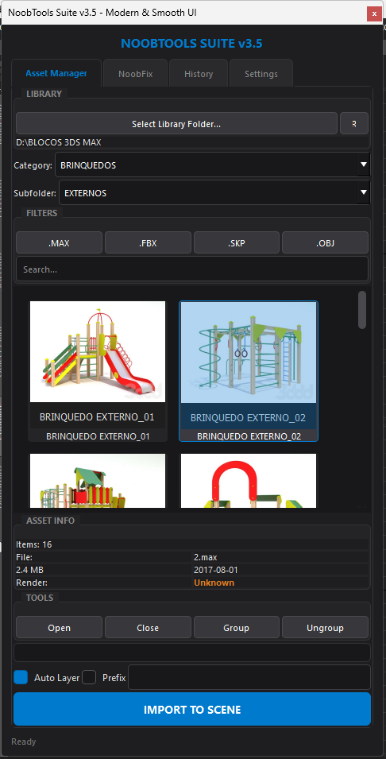

# 🛠️ NoobTools Suite para 3ds Max

O **NoobTools Suite** é um plugin avançado e completo desenvolvido em Python (PySide) e MaxScript para o Autodesk 3ds Max. O seu principal objetivo é otimizar o fluxo de trabalho de artistas 3D, oferecendo um gestor de bibliotecas de modelos ultrarrápido, interface moderna e ferramentas inteligentes para diagnóstico e reparação de cenas (relink).

---

## ✨ Funcionalidades Completas

A ferramenta está dividida em 4 abas principais, cada uma desenhada para otimizar uma parte específica do teu fluxo de trabalho:

### 1. 📦 Asset Manager (Gestor de Biblioteca)

- **Gestão de Pastas e Favoritos:** Seleciona a pasta raiz da tua biblioteca. Clica com o botão direito no botão para adicionar ou aceder rapidamente aos teus caminhos Favoritos.
- **Filtros Inteligentes e Pesquisa:** Navega automaticamente por Categorias e Subcategorias. Filtra ficheiros por formato (`.MAX`, `.FBX`, `.SKP`, `.OBJ`) ou utiliza a barra de pesquisa de texto.
- **Miniaturas Assíncronas (Thumbnails):** O plugin gera e armazena em cache as miniaturas dos teus modelos em segundo plano. O 3ds Max nunca congela enquanto navegas!
- **Deteção de Renderizador:** Sem precisar abrir o ficheiro, o plugin lê os metadados do `.max` e mostra na aba "Asset Info" qual o motor de render utilizado (V-Ray, Corona, Arnold, FStorm, etc.).
- **Importação Avançada e em Massa:** \* Seleciona um ou vários assets e importa-os de uma só vez (Batch Import) com uma barra de progresso fluida.
  - Opções automáticas para organizar os objetos em **Camadas (Auto Layer)** e adicionar **Prefixos**.
- **Ferramentas de Hierarquia (Tools):** Agrupa, desagrupa, abre ou fecha grupos diretamente pela interface antes ou depois de importar.

### 2. 🔗 NoobFix (Diagnóstico e Relink)

- **Scan Inteligente de Cena:** Analisa a tua cena atual e lista todos os _assets_ (texturas, proxies, etc.) que estão em falta.
- **Seleção Direta:** Clica duas vezes num ficheiro em falta na lista para selecionar automaticamente os objetos na cena que estão a usar esse material!
- **Relink em Background:** Procura texturas perdidas numa pasta raiz (e subpastas). O processo roda numa _Thread_ separada, permitindo que continues a usar o 3ds Max enquanto ele religa milhares de ficheiros.
- **Ferramentas de Diagnóstico:**
  - `STRIP`: Remove caminhos de rede quebrados de forma irreversível e limpa a tua cena.
  - `UNC`: Converte caminhos locais (ex: `C:\texturas`) para caminhos de rede absolutos.
  - `COLETAR`: Copia todas as texturas usadas na cena diretamente para a pasta "Maps" do teu projeto atual.
- **Opções de Relink:** Podes escolher ignorar extensões (útil se trocaste de JPG para PNG) e incluir subpastas na procura.

### 3. 🕒 History (Histórico)

- Um registo organizado em tabela que mostra tudo o que foi importado recentemente.
- Consulta facilmente a **Data, Hora, Nome do Ficheiro e Tipo** das tuas últimas importações.
- Possibilidade de limpar ou atualizar o histórico manualmente.

### 4. ⚙️ Settings (Configurações)

- **Auto-Backup:** Uma funcionalidade de segurança salva automaticamente uma cópia da tua cena (na pasta `_backup`) antes de ações que alteram muito a cena (como importações massivas ou usar o _Strip_).
- **Gestão de Cache:** Visualiza em tempo real o tamanho (em MB) que as miniaturas estão a ocupar no teu disco e limpa a cache com apenas um clique para libertar espaço.

---

## 🎨 Interface Gráfica (UI/UX)

- **Modern & Smooth UI:** Design totalmente customizado em tons escuros (Dark Mode), ideal para artistas 3D.
- **Responsividade:** Scrollbars personalizadas, botões com áreas de clique maximizadas e ponteiro do rato interativo.
- A janela do script é "ancorada" nativamente ao 3ds Max, respeitando as sobreposições de janelas do Windows.

---

## 💻 Requisitos do Sistema

- **Autodesk 3ds Max:** Compatível com versões de 2020 a 2025+.
- **Motor:** Funciona com o ambiente Python nativo do 3ds Max (suporta PySide2 e PySide6 automaticamente).

---

## 🚀 Como Instalar

O plugin é distribuído num instalador empacotado (`.mzp`), tornando o processo muito simples:

1. Descarrega o ficheiro de instalação `.mzp` aqui do repositório (na secção de _Releases_).
2. Abre o **Autodesk 3ds Max**.
3. No menu superior, vai a **`Scripting` > `Run Script...`** _(Em versões mais antigas do Max, o menu chama-se apenas `MAXScript`)_.
4. Seleciona o ficheiro `.mzp` que descarregaste e clica em **Open**.
5. O instalador fará o resto! _(Nota: Arrastar e soltar o ficheiro `.mzp` diretamente na viewport não funciona, por favor utiliza o menu Run Script)._
6. Podes agora atribuir a ferramenta a um atalho ou botão na tua _Toolbar_ através do menu `Customize User Interface`.

---

## 👨‍💻 Contribuições

Este é um projeto em constante evolução. Sentes que falta alguma ferramenta, tens ideias para melhorar o código ou encontraste algum _bug_?
Sente-te à vontade para abrir uma _Issue_ ou submeter um _Pull Request_!

---

## 📄 Licença

Este projeto é de código aberto e está disponível sob a licença MIT. Sente-te livre para usar, modificar e distribuir.
